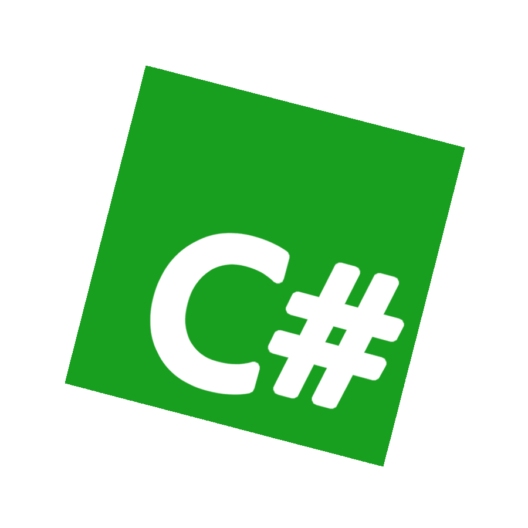

<h1><a href="https://roblox-cs.com">roblox-cs</a></h1>
<p>A C# to Luau transpiler for Roblox</p>
<br/>

<div align="center">
	<a href="https://discord.gg/nFcsW3C33u"></a>
	<a href="https://github.com/roblox-csharp/roblox-cs/actions"></a>
    <a href="https://github.com/roblox-csharp/roblox-cs/actions"></a>
	<a href="https://coveralls.io/github/roblox-csharp/roblox-cs?branch=master"></a>
</div>

### Introduction

roblox-cs is a [C#](https://learn.microsoft.com/en-us/dotnet/csharp/) to [Luau](https://luau.org/) transpiler, which means we effectively translate C# code into
Luau. This is done by taking the C# AST and converting it into a Luau AST (that is functionally the same) and then finally rendering the Luau AST into Luau
source code.

### Examples

#### Hello, world!

```cs
print("Hello, roblox-cs!");
```
```luau
-- Compiled with roblox-cs v2.0.0

print("Hello, roblox-cs!")
return nil
```

#### Classes
**Note:** In the future this example will import the `CS` library. It will also probably abandon `typeof()`.

```cs
var myClass = new MyClass(69);
myClass.DoSomething();
print(myClass.MyProperty); // 69
print(myClass.MyField); // 0

class MyClass(int value)
{
  public readonly int MyField;
  public int MyProperty { get; } = value;

  public void DoSomething() =>
    print("doing something!");
}
```
```luau
-- Compiled with roblox-cs v2.0.0

local MyClass
do
  MyClass = setmetatable({}, {
    __tostring = function(): string
      return "MyClass"
    end
  })
  MyClass.__index = MyClass
  MyClass.__className = "MyClass"
  function MyClass.new(value: number): MyClass
    local self = (setmetatable({}, MyClass) :: any) :: MyClass
    return self:MyClass(value) or self
  end
  function MyClass:DoSomething(): ()
    return print("doing something!")
  end
  function MyClass:MyClass(value: number): MyClass?
    return nil
  end
end
CS.defineGlobal("MyClass", MyClass)
type MyClass = typeof(MyClass)

local myClass = MyClass.new(69)
myClass:DoSomething()
print(myClass.MyProperty)
print(myClass.MyField)
return nil
```

#### Type Reflection
**Note:** `Object.GetType()` is not supported.

```cs
var intType = typeof(int);
print(intType.Name); // Int32
print(intType.Namespace); // System
print(intType.BaseType.Name); // ValueType
```
```luau
local intType = { --[[ insert type info here ]] }; 
print(intType.Name);
print(intType.Namespace);
print(intType.BaseType.Name);
```

### Join the Community!
<a href="https://discord.gg/nFcsW3C33u"></a>
